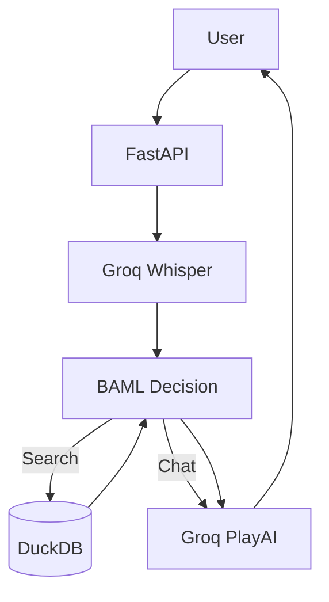

# VAI - Voice AI Hospital Assistant

VAI is a modern, voice-interactive assistant designed to help users find hospital network information. It leverages high-performance AI models for speech recognition, natural language understanding, and speech synthesis.

## Features
- **Voice Interaction:** Speak naturally to the assistant.
- **Real-time Audio Visualization:** Beautiful UI visualizing audio frequencies.
- **Intelligent Routing:** Distinguishes between general chat, search queries, and clarifications.
- **Fast Retrieval:** Uses DuckDB for instant hospital data lookups.
- **Modern UI:** Built with a clean, dark-mode "Shadcn" inspired design.

---

## 🛠️ Detailed Setup Guide

Follow these steps to get the application running on your local machine.

### 1. Install `uv` (Fast Python Package Installer)

This project uses `uv` for extremely fast dependency management.

**macOS / Linux:**
```bash
curl -LsSf https://astral.sh/uv/install.sh | sh
```

**Windows:**
```powershell
powershell -c "irm https://astral.sh/uv/install.ps1 | iex"
```

*After installation, restart your terminal or run `source $HOME/.cargo/env` (on macOS/Linux).*

### 2. Clone the Repository

```bash
git clone <repository-url>
cd VAI
```

### 3. Setup Virtual Environment & Sync Packages

Create a virtual environment and install all required dependencies in one go:

```bash
# Create a virtual environment (.venv)
uv venv

# Activate the virtual environment
source .venv/bin/activate

# Sync dependencies from pyproject.toml
uv sync
```

### 4. Configuration: API Keys

You need a **Groq API Key** to run this project. Groq powers the LLM (Llama 3.3), Speech-to-Text (Whisper), and Text-to-Speech (PlayAI).

1.  **Get the Key:**
    *   Go to the [Groq Cloud Console](https://console.groq.com/keys).
    *   Log in and click **"Create API Key"**.
    *   Copy the key (starts with `gsk_`).

2.  **Set up Environment Variables:**
    *   In the project root, create a file named `.env` (you can copy the example).
    ```bash
    cp .env.example .env
    ```
    *   Open `.env` in a text editor and paste your key:
    ```bash
    GROQ_API_KEY=gsk_your_copied_key_here
    ```

### 5. Run the Application

We have provided a simple script to start both the Backend (FastAPI) and Frontend (Web Server) simultaneously.

**Using the Startup Script (Recommended):**
```bash
# Make the script executable (only needed once)
chmod +x start.sh

# Run it
./start.sh
```

**Manual Startup:**
If you prefer to run them separately:
*   **Backend:** `uv run main.py` (Runs on http://localhost:8000)
*   **Frontend:** `python3 -m http.server 3000 --directory frontend` (Runs on http://localhost:3000)

---

## 🏗️ Architecture Overview

The system uses a pipeline approach to handle voice requests:

1.  **Audio Capture:** Frontend records and sends audio.
2.  **Transcription:** Groq Whisper converts audio to text.
3.  **Decision Logic:** BAML (Llama 3.3) decides if a database search is needed.
4.  **Data Lookup:** DuckDB queries the local dataset if required.
5.  **Response Generation:** BAML synthesizes a natural answer.
6.  **Speech Synthesis:** Groq PlayAI generates the response audio.

**System Diagram:**



For a detailed breakdown, check [docs/architecture.md](docs/architecture.md).